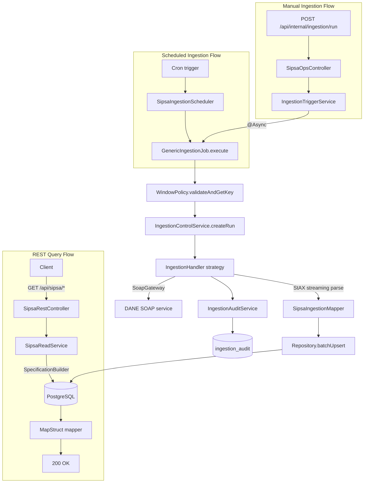

# Project Architecture — SIPSA Integration Service

**Version:** 1.0
**Date:** 2026-07-13
**Status:** Living reference document (not an ADR, not a roadmap)

---

## Purpose of This Document

This document is the **single, canonical description of the currently approved
architecture** of the SIPSA Integration Service. It exists so that any developer or AI
agent can understand the system's structure, principles, and rules without reading every
ADR, backlog story, and review document individually.

**What this document is:**
- A synthesis of decisions already made and accepted.
- The reference to consult before touching any structural boundary.

**What this document is NOT:**
- Not an ADR — it records no new decision. See the [ADR Index](../adr/README.md) for decisions.
- Not a roadmap — it contains no implementation plan. See the
  [Implementation Roadmap](implementation-roadmap.md) and
  [Technical Backlog](../backlog/technical-backlog.md) for planned work.
- Not a place for unapproved ideas. Anything still `Proposed` is out of scope here by
  design (see [Future Evolution](#future-evolution) for how those are acknowledged without
  being adopted).

**Sources consolidated into this document:** [ADR-000](../adr/ADR-000-current-architecture.md)
(architecture snapshot), [ADR-004](../adr/ADR-004-transaction-boundaries.md) (Accepted),
[ADR-007](../adr/ADR-007-package-boundaries-and-internal-models.md) (Accepted, scoped),
[Architecture Review](architecture-review.md), [Technical Debt Registry](technical-debt.md),
[Refactoring Roadmap](refactoring-roadmap.md), [Testing Strategy](testing-strategy.md), and
the [Technical Backlog](../backlog/technical-backlog.md). Where those documents disagree
because one is newer, this document follows the most recently accepted decision and says so.

### A Note on Merge Status

Two accepted, evidence-backed bodies of work are represented
here even though their code has not yet been merged to `main` — they were reviewed,
approved, and pushed to `origin`, but merging is a separate, deliberate step not yet taken:

- **ADR-007** (package boundaries) — commits live on `refactor/internal-models-and-api-filter`
  and `refactor/package-structure-and-boundaries` (both pushed).
- **TECH-110** (scheduled ingestion validation) — commits live on
  `test/scheduled-ingestion-jobs` (pushed).

This document describes the **approved** architecture, which includes both. Wherever a
detail depends on one of these not-yet-merged branches, it is marked
**(pending merge)**. Everything not marked this way is already on `main`.

---

## Project Vision

The SIPSA Integration Service wraps Colombia's DANE (Departamento Administrativo Nacional
de Estadística) SIPSA SOAP web service — the official source of agricultural price and
supply data — behind a modern REST API.

**Purpose:** replace direct SOAP/XML consumption with a REST interface that offers
pagination, filtering, and timezone-aware responses, while automatically keeping a local
PostgreSQL copy of DANE's published data in sync.

**Scope:** a single bounded context — five DANE data types (`Ciudad`, `Parcial`,
`Mayoristas` weekly/monthly, `Abastecimientos` monthly) — plus the operational machinery
needed to ingest them reliably (scheduling, run tracking, audit trail).

**Integration with SIPSA/DANE:** the system is a **consumer**, not a system of record. DANE
remains authoritative; this service ingests, stores, and republishes a queryable copy.
Ingestion is triggered both automatically (cron, aligned with DANE's publication schedule)
and manually (an internal operational endpoint).

**Long-term objective:** reliable, idempotent ingestion and accessible querying — not
complex business logic. The domain is deliberately thin (see
[Domain Model](#domain-model)); the engineering investment goes into the ingestion pipeline's
correctness (memory-safe SOAP streaming, transactional resilience, auditability), not into
domain modeling.

---

## Architectural Style

**Layered architecture**, organized by technical responsibility
(`api` / `application` / `domain` / `infrastructure`), **not** by business feature.

- **Not hexagonal/ports-and-adapters in the formal sense.** There is exactly one true port:
  the `SoapGateway` interface (domain) implemented by `SoapGatewayImpl` (infrastructure).
  This gives the domain independence from the SOAP transport without the ceremony of a full
  ports-and-adapters structure applied to every boundary. ADR-000 documents this decision
  explicitly ("Why Not Hexagonal Architecture") — do not describe this system as hexagonal;
  it borrows one hexagonal idea, deliberately, not the whole pattern.
- **Not DDD in the tactical sense.** There are no Aggregate Roots, no domain events, no
  Value Objects, no domain services. Entities are JPA-backed data containers mirroring
  DANE's source records (see [Domain Model](#domain-model)). ADR-000 documents this
  decision explicitly ("Why Not Full DDD Tactical Patterns"). Do not call this "DDD Lite" —
  it is a thin, honest data-integration domain, not an intentionally reduced DDD.
  Reconsider only if the system grows business rules that operate across entity boundaries
  (price anomaly detection, multi-source fusion) — not before.
- **Not microservices.** Single bounded context, single external dependency (DANE SOAP),
  single database. ADR-000 documents this explicitly ("Why Not Microservices").

If asked to categorize this system in one phrase: **a layered, four-package Spring Boot
integration service**, with one domain-level port (`SoapGateway`) and a template-method +
strategy ingestion pipeline. Nothing more elaborate should be assumed.

---

## Architectural Principles

| Principle | What it means here |
|---|---|
| **Separation of responsibilities by layer** | `api` handles HTTP concerns only; `application` orchestrates business rules; `domain` holds contracts and entities; `infrastructure` implements technical concerns (SOAP, persistence, config). See [Package Organization](#package-organization). |
| **Dependencies point toward the domain** | `infrastructure` implements `domain` interfaces (`SoapGateway`); `domain` depends on nothing outside itself. Confirmed by evidence: zero `domain → infrastructure` imports exist today (verified 2026-07-13, see ADR-007 F4). |
| **Infrastructure is replaceable** | The SOAP transport is isolated behind `SoapGateway`. Swapping the SOAP client implementation would not touch `application` or `domain`. |
| **Composition over inheritance, used narrowly** | `IngestionJob` (abstract) + `GenericIngestionJob` is a deliberate Template Method; `IngestionHandler` is a Strategy interface with 5 implementations. Inheritance is used exactly once, for a well-understood, stable algorithm shape — not as a general pattern. |
| **Explicit contracts** | Request/response DTOs are Java records with Bean Validation. Internal application commands (`IngestionRequest`, `CreateRunRequest`, `AuditEventRequest`) are explicitly *not* HTTP contracts — they live in `application/command`, never bound from `@RequestBody`. |
| **Idempotency** | Every ingestion run is keyed by `(method_name, window_key)`, enforced by a database unique constraint. Re-running a completed window is a no-op unless `force=true`. |
| **Backward compatibility of the public contract** | `/api/sipsa/**` routes, JSON shapes, and HTTP status codes are treated as a contract. Changes to them require an ADR (see [ADR-003](../adr/ADR-003-error-response-model.md), currently `Proposed`, precisely because it would change the error contract). |
| **Decisions are recorded, not assumed** | Structural or cross-cutting decisions go through an ADR (`docs/adr/`). Debt and deferred work are tracked, not silently accepted or silently fixed (see [Technical Debt](#technical-debt)). |
| **Evidence over instinct** | Findings in review documents are backed by file/line citations, not impressions. This document follows the same discipline: every non-obvious claim below traces to an ADR, a backlog story, or a specific file. |

---

## Package Organization

```
com.dalejandrov.sipsa/
├── api/              ← HTTP boundary: controllers, DTOs, mappers, filters, utilities
├── application/      ← Orchestration: services, ingestion pipeline, scheduler, commands
├── domain/           ← Core contracts: entities, exceptions, SoapGateway interface
└── infrastructure/   ← Technical implementations: SOAP client, repositories, config
```

### `api/` — HTTP boundary

- REST controllers: `SipsaRestController` (public, `/api/sipsa`), `SipsaOpsController` and
  `IngestionAuditController` (internal, `/api/internal/**`).
- Request/response DTOs (`api/dto/request`, `api/dto/response`) — genuine HTTP contracts,
  bound from `@RequestBody`/`@ModelAttribute`/query parameters.
- MapStruct mappers (`api/mapper`) — entity → response DTO conversion.
- `GlobalExceptionHandler` — maps the exception hierarchy to structured HTTP error
  responses.
- `TimezoneFilter` (`api/filter` **— pending merge**, see note below) — reads `X-Timezone`,
  sets a thread-local zone for response conversion.

### `application/` — orchestration and business rules

- Read services (`SipsaReadService`, `IngestionRunQueryService`, `AuditTrailService`) —
  query with filtering/pagination.
- Trigger services (`IngestionTriggerService`, `AsyncIngestionService`) — manual ingestion
  entry point.
- The ingestion pipeline: `IngestionJob` (abstract Template Method) + `GenericIngestionJob`,
  `WindowPolicy` (execution-window validation and idempotency-key generation),
  `IngestionContext` (per-run mutable state), five `IngestionHandler` implementations
  (Strategy), `SipsaIngestionScheduler` (cron triggers).
- `IngestionControlService`, `IngestionAuditService` — run lifecycle and audit persistence.
- **`application/command`** (**pending merge**, see note below) — internal application
  commands (`IngestionRequest`, `CreateRunRequest`, `AuditEventRequest`). Per
  [ADR-007](../adr/ADR-007-package-boundaries-and-internal-models.md) F1: none of these
  three is ever bound from an HTTP request; all are built via internal static factories and
  consumed exclusively inside `application`. They do not belong in an HTTP DTO package.

### `domain/` — core contracts

- JPA entities: `SipsaCiudad`, `SipsaParcial`, `SipsaMayoristasSemanal`,
  `SipsaMayoristasMensual`, `SipsaAbastecimientosMensual`, `IngestionRun`, `IngestionAudit`,
  `IngestionReject`.
- 7-type exception hierarchy (validation, business, infrastructure, SOAP-related).
- `SoapGateway` — the one interface the domain exposes for infrastructure to implement.

### `infrastructure/` — technical implementations

- `SoapGatewayImpl`, `SoapStreamingClient` (native `HttpClient` streaming, retry, GZIP),
  `AbstractStaxParser` + 5 concrete StAX parsers, `SipsaIngestionMapper` (SOAP DTO → entity).
- 8 Spring Data JPA repositories (one per entity) + `SpecificationBuilder` (dynamic JPA
  Specification construction, always evaluated in the configured business timezone — see
  [Scheduling](#scheduling)).
- Configuration: `AsyncConfig`, `SchedulingConfig`, `PaginationConfig`,
  `SipsaSoapClientConfig`.
- `SipsaHealthIndicator` — custom Actuator health check based on data freshness.

### Rules that govern this organization (verified, not aspirational)

| Rule | Status | Evidence |
|---|---|---|
| `domain` must not depend on `infrastructure` | **Holds today** | Zero `domain → infrastructure` imports (verified by `grep`; the one exception — a Javadoc-only reference — was removed, ADR-007 F4, **pending merge**). |
| `infrastructure` must not depend on `api` | **Holds today** (pending merge) | The one prior exception (`TimezoneFilter` importing `api.util.TimezoneUtil`) is resolved by relocating the filter itself into `api/filter`, not by breaking the dependency (ADR-007 F2, **pending merge**). |
| `application` should minimize dependence on `api` | **Partially holds, by design** | 9 files with `application → api` imports before ADR-007; 5 remain after (**pending merge**) — see the next row for why those 5 are legitimate. |
| The 5 remaining `application → api` imports are accepted, not overlooked | **Confirmed** | `IngestionTriggerService` (genuine HTTP DTOs `IngestionTriggerRequest`/`Response`), `SipsaReadService` + `IngestionRunQueryService` + `AuditTrailService` (a consistent, deliberate pattern: read services assemble response-shaped output via `api.mapper`/`api.dto.response` — investigated and explicitly kept, not a violation), `IngestionAuditService`/`AuditTrailService` (genuine HTTP request DTO `AuditQueryRequest`; `AuditTrailService` also uses `TimezoneUtil`, a single deferred call site, not blocking). |
| Controllers must not access repositories directly | **Holds today** | No `api.controller` file imports `infrastructure.persistence.repository`. |
| No compiler-enforced check exists yet for any of the above | **True** | ArchUnit is not adopted. TECH-093 (Pending) will add rules for exactly these three boundaries once ADR-007's implementation merges. Until then, these rules are enforced by review discipline only. |

---

## Request Flow

Four request flows exist. All read/query flows follow the same shape; ingestion has two
entry points (scheduled and manual) that converge on the same pipeline.



The full transaction-boundary detail for the ingestion path (which steps commit
independently, why no SOAP call is ever inside a database transaction) is the subject of
[ADR-004](../adr/ADR-004-transaction-boundaries.md) (Accepted) — this document does not
repeat it.

---

## Domain Model

**Entities** (JPA-backed, one per DANE data type plus three operational tables):
`SipsaCiudad`, `SipsaParcial`, `SipsaMayoristasSemanal`, `SipsaMayoristasMensual`,
`SipsaAbastecimientosMensual` (data); `IngestionRun`, `IngestionAudit`, `IngestionReject`
(operational). All temporal fields use `Instant`, matching `TIMESTAMPTZ` columns.

**Aggregates:** none, deliberately. This is not a DDD-modeled domain (see
[Architectural Style](#architectural-style)). Entities are independent, flat data
containers; there is no aggregate root enforcing cross-entity invariants.

**Internal commands** (`application/command`, **pending merge**): `IngestionRequest`,
`CreateRunRequest`, `AuditEventRequest` — carry state between services inside the
ingestion/audit pipeline. Never bound from HTTP.

**HTTP DTOs** (`api/dto/request`, `api/dto/response`): one request/response pair per query
endpoint, plus operational DTOs for the internal ingestion/audit endpoints. Records with
Bean Validation annotations. These are the genuine public contract.

**Mappers** (`api/mapper`, MapStruct): one per data type, entity → response DTO, with
timezone-aware conversion for system-generated timestamps (see
[Time Strategy](#time-strategy)). A separate mapper (`infrastructure/soap/mapper`) handles
SOAP DTO → entity.

**Repositories**: one Spring Data JPA repository per entity (8 total), each with its own
deduplication strategy on upsert (business key, `tmpId` when DANE provides one, or — for
`SipsaParcial` — a currently non-functional key, tracked as a known, accepted debt item; see
[Technical Debt](#technical-debt)).

---

## Scheduling

Three cron-based jobs exist, all declared on `SipsaIngestionScheduler`, all evaluated in
the configured functional timezone (`sipsa.timezone`, default `America/Bogota`, an explicit
`zone` attribute on every `@Scheduled` annotation — never the JVM/container default):

| Job | Schedule | Methods triggered |
|---|---|---|
| Daily window | 14:20 daily | `promediosSipsaCiudad`, `promediosSipsaParcial`, `promediosSipsaSemanaMadr` (sequential) |
| Monthly — Mayoristas | Day 8, 14:30 | `promediosSipsaMesMadr` |
| Monthly — Abastecimientos | Day 10, 14:30 | `promedioAbasSipsaMesMadr` |

These times include a deliberate 20–30 minute operational buffer over DANE's documented
publication time (~14:00 local).

**Cron vs. `WindowPolicy` — two distinct mechanisms, not one:**
- **Cron** (`SipsaIngestionScheduler`) decides *when a trigger fires*. It is already
  correctly scoped per method (the Mayoristas-monthly cron only ever fires on day 8; the
  Abastecimientos-monthly cron only ever fires on day 10 — there is no overlap at the cron
  level).
- **`WindowPolicy`** is an independent safety check evaluated every time *any* ingestion
  request reaches the pipeline — scheduled or manual — deciding whether that request is
  allowed to proceed right now, and producing the idempotency key (`windowKey`) used by the
  `(method_name, window_key)` uniqueness guarantee. It exists specifically so that a manual
  trigger (`POST /api/internal/ingestion/run`) cannot bypass the same business-hours/business-day
  rules the cron already respects, unless `force=true` is explicitly passed.

This document does not enumerate `WindowPolicy`'s current behavior in more detail, because
a validated, evidence-backed review of that behavior exists separately and is being acted
on: see [Scheduled Ingestion Validation](scheduled-ingestion-validation.md) (**pending
merge**, branch `test/scheduled-ingestion-jobs`) for the full validation, and
[Future Evolution](#future-evolution) for the corrective story it produced.

---

## Time Strategy

**Only decisions that are approved are documented here.** A formal, complete strategy for
API-facing timezone/locale/date-semantics is **not yet approved** — see
[Future Evolution](#future-evolution).

What is approved and in effect today:

- **`America/Bogota` is the functional business zone** for scheduling and window
  validation (`WindowPolicy`, `SipsaIngestionScheduler`, `SpecificationBuilder`'s calendar
  filters). This is deliberate: DANE's publication schedule is Colombia-local, and
  `America/Bogota` has no daylight-saving transitions, which removes an entire class of
  scheduling ambiguity.
- **`Instant` + `TIMESTAMPTZ` is the storage representation for instants** (audit
  timestamps, run start/end times, system-generated sync timestamps). This is consistent
  across every entity that has a temporal field.
- **API responses expose `OffsetDateTime`** (ISO-8601 with explicit offset) for temporal
  fields, and a client-supplied `X-Timezone` header (via `TimezoneFilter`) controls how
  *system-generated* timestamps are presented, defaulting to UTC when absent or invalid.

**Not yet decided:** whether every temporal field's *type* correctly reflects its semantics
(e.g., whether fields that represent a calendar date, not an instant, should be `LocalDate`
instead of `OffsetDateTime`); locale/message internationalization; the exact contract for
an invalid `X-Timezone` header. These are documented as open questions in
[ADR-008](../adr/ADR-008-timezone-locale-and-date-semantics.md), which remains
**`Proposed`**. Do not treat any part of ADR-008 as decided.

---

## Error Handling

**Mechanism:** `GlobalExceptionHandler` (`@ControllerAdvice`), one handler method per
exception type in the domain exception hierarchy plus the standard Spring MVC binding
exceptions.

**Contract:** every error response is a structured JSON body with a stable `code` field
(e.g., `VALIDATION_ERROR`, `BUSINESS_ERROR`, `INGESTION_ERROR`, `EXTERNAL_ERROR`), an HTTP
status, and a human-readable `message`. Codes are independent of message wording, which is
the correct precondition for future localization (see [ADR-008](../adr/ADR-008-timezone-locale-and-date-semantics.md),
`Proposed` — not yet implemented).

**Not RFC 9457 `ProblemDetail`.** This was evaluated and explicitly not adopted (see
[ADR-003](../adr/ADR-003-error-response-model.md), `Proposed`, and
[Refactoring Roadmap RF-09](refactoring-roadmap.md#rf-09--adopt-rfc-9457-problemdetail-for-error-responses)):
the current custom `ErrorResponse` is functional and consistent; adopting `ProblemDetail`
would be a breaking field-name change with no current external-client requirement driving
it.

**Validation:** Jakarta Bean Validation on request DTOs (`@NotBlank`, `@Min`, `@Max`, etc.),
surfaced as field-level errors in the `400` response body.

**No changes are proposed here** — this section reflects current, in-effect behavior only.
Known error-handling debt (wrong HTTP status for two exception types, missing correlation
ID) is tracked, not fixed by this document — see [Technical Debt](#technical-debt).

---

## Testing Strategy

Full detail lives in [Testing Strategy](testing-strategy.md); this section only orients.

**Pyramid:** unit tests (pure Java, no Spring context) as the immediate priority;
integration tests (Spring context / WireMock / Testcontainers) deferred pending a tooling
decision (TECH-044, SPIKE); no E2E/contract tier is planned (system boundary is DANE's live
SOAP service, not something to test against directly).

**On `main` today:** a single context-load test (`SipsaApplicationTests`) — confirms the
Spring context wires correctly; provides no behavioral coverage.

**Approved, pending merge** (branch `test/scheduled-ingestion-jobs`; see
[Scheduled Ingestion Validation](scheduled-ingestion-validation.md)): 58 additional tests,
bringing the total to 59 — `WindowPolicyTest` (daily/monthly window boundaries, timezone
correctness, `windowKey` semantics, all via an injected `Clock` — no test depends on the
system clock), `SipsaSchedulingCronTest` (validates the three production cron expressions
with `CronExpression`, including month/year rollover and a leap-year case), a scheduler
dispatch test (`GenericIngestionJob` mocked — verifies which methods are triggered, with
what flags, and that one method's failure does not stop the others), and two Spring context
tests proving the scheduling wiring is correct both enabled and disabled.

**Not yet covered:** `SpecificationBuilder`, `IngestionJob`'s full lifecycle,
`GlobalExceptionHandler` — all planned (TECH-041/042/043), none implemented.

**Architecture tests:** none exist yet. ArchUnit adoption (TECH-093) is gated on the
package-boundary work above merging first, so the rules assert the post-move state rather
than failing on day one.

---

## Documentation Strategy

Which document answers which question:

```
README.md               → "What is this and how do I run it?"
        ↓
project-architecture.md → "How is this system structured, and why?" (this document)
        ↓
docs/adr/                → "Why was a specific structural decision made?"
        ↓
docs/backlog/             → "What work is planned, and what are its acceptance criteria?"
        ↓
docs/architecture/*-roadmap.md → "In what order, and what was deliberately deferred?"
        ↓
docs/diagrams/            → "What does this look like visually?"
```

Practical rule: if a question is about **current, approved structure**, start here. If it's
about **why**, go to the relevant ADR. If it's about **what's next**, go to the backlog and
roadmaps. This document links to all of them; it does not duplicate their content.

---

## Accepted ADRs

Only `Accepted` decisions are listed. `Proposed` ADRs (ADR-001, ADR-002, ADR-003, ADR-005,
ADR-006, ADR-008) are **not** included — see [Future Evolution](#future-evolution) for how
they are acknowledged without being treated as decided.

| ADR | Status | Description |
|---|---|---|
| [ADR-000](../adr/ADR-000-current-architecture.md) | Accepted (informational) | Point-in-time architecture snapshot after the Spring Boot 4 / Java 25 migration. Not a decision record — this document (`project-architecture.md`) is its living successor. |
| [ADR-004](../adr/ADR-004-transaction-boundaries.md) | Accepted | No enclosing transaction around ingestion; lifecycle operations use `REQUIRES_NEW`; SOAP calls are explicitly prohibited inside a database transaction. |
| [ADR-007](../adr/ADR-007-package-boundaries-and-internal-models.md) | Accepted (partial / scoped) | Moves internal commands out of `api/dto/request` into `application/command`; relocates `TimezoneFilter` into `api/filter`; removes the one `domain → infrastructure` Javadoc reference. Explicitly does **not** authorize general package reorganization, DTO/mapper relocation beyond the 3 named classes, or separating the JPA model from the domain model. **Implementation pending merge to `main`.** |

---

## Technical Debt

Full registry: [Technical Debt Registry](technical-debt.md) (28 items). Summary only —
**do not** duplicate the table here; consult the registry for IDs, evidence, and backlog
links.

**Known and accepted (tracked, not yet fixed):**
- No authentication on internal endpoints (`/api/internal/**`) — **Critical**, blocking
  TECH-001, pending an authentication-mechanism decision (ADR-002, `Proposed`).
- `SipsaParcial` deduplication is non-functional (random key) — **Critical**, blocking
  TECH-011, pending a business-key decision (ADR-001, `Proposed`, TECH-010 SPIKE).
- Near-zero test coverage on `main` today, though this is actively being closed (see
  [Testing Strategy](#testing-strategy) above).
- Several HTTP-semantics mismatches (wrong status codes for two exception types), N+1 query
  in one repository's fallback path, unnamed `@Async` executor, and various small
  code-quality items — all **Low/Medium**, all tracked with backlog IDs.

**Deferred, deliberately (not silently forgotten):** the [Refactoring Roadmap](refactoring-roadmap.md)
records 10 refactoring ideas considered and explicitly not implemented now, each with a
stated condition for revisiting (e.g., splitting `IngestionControlService` only if it grows
past 500 lines; feature-based repackaging only if the project gains independent bounded
contexts). **Caution:** the roadmap's RF-01 entry ("move internal DTOs... 15+ files") predates
ADR-007 and is now partially superseded — ADR-007 accepted a narrower version of exactly
this move (3 named classes, 5 remaining `application → api` files after, not 15+). When the
two disagree, ADR-007 is authoritative.

---

## Future Evolution

Existing, already-recorded initiatives only — nothing proposed here for the first time.
Items marked **Pending Decision** require an ADR or SPIKE to resolve before implementation.

| Initiative | State | Reference |
|---|---|---|
| Fix `WindowPolicy` monthly day-to-method binding, grace days, and stable window keys | Plan approved (documental), **not implemented** | TECH-111, [Scheduled Ingestion Validation](scheduled-ingestion-validation.md) |
| Timezone, locale, and date-semantics strategy | **Pending Decision** — ADR-008 is `Proposed`, not accepted | [ADR-008](../adr/ADR-008-timezone-locale-and-date-semantics.md) |
| ArchUnit package-boundary rules | Pending — gated on ADR-007's implementation merging first | TECH-093 |
| Separate CXF-generated SOAP sources from hand-written code | **Pending Decision** — blocked on a SPIKE | TECH-092 (blocked by TECH-094) |
| `isMonthly()` as an explicit `IngestionHandler` contract method | **Pending Decision** — ADR-006 is `Proposed` | ADR-006, TECH-055 (SPIKE) |
| Internal endpoint authentication mechanism | **Pending Decision** — ADR-002 is `Proposed` | ADR-002, TECH-001 |
| `SipsaParcial` natural deduplication key | **Pending Decision** — ADR-001 is `Proposed` | ADR-001, TECH-010 (SPIKE) |
| Scheduler dispatch: synchronous vs. async | **Pending Decision** — ADR-005 is `Proposed` | ADR-005, TECH-053 |
| RFC 9457 `ProblemDetail` error responses | **Pending Decision** — ADR-003 is `Proposed`; only revisit if an external client requires it | ADR-003 |

No other initiative (event-driven architecture, messaging, microservices, or similar) has
been proposed anywhere in this project's documentation as of this document's date. If such
an idea arises, it starts as an ADR, not as an edit to this document.

---

*This document supersedes ADR-000 as the primary architecture reference going forward.
ADR-000 remains available as the historical point-in-time snapshot it always was.*
